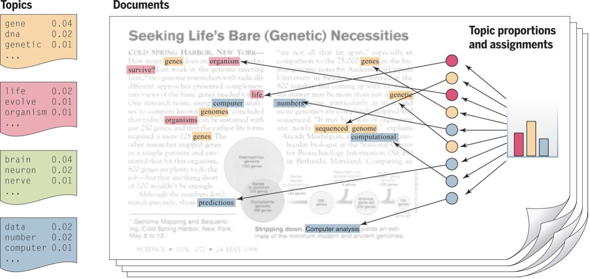
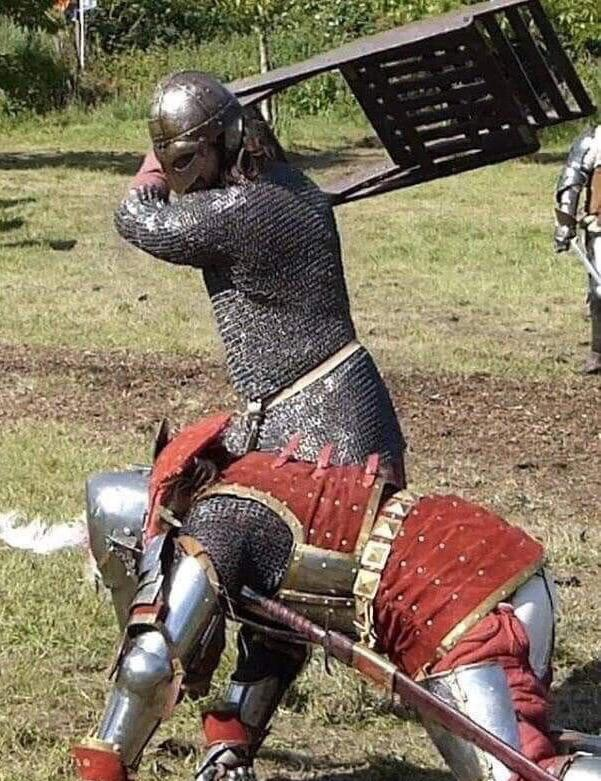

class: animated, fadeIn
layout: true

---
```{r setup, include=FALSE}
library(DiagrammeR)
options(htmltools.dir.version = FALSE,
        htmltools.preserve.raw = FALSE)
knitr::opts_chunk$set(fig.retina = 4,
                      warning = FALSE,
                      message = FALSE,
                      echo = FALSE)
set.seed(123)
```

```{r xaringan-themer, include=FALSE, warning=FALSE}
library(xaringanthemer)

extra_css <- list(
  ".tiny" = list("font-size" = "40%"),
  ".small" = list("font-size" = "70%"),
  ".large" = list("font-size" = "130%"),
  ".xlarge" = list("font-size" = "200%"),
  ".full-width" = list(
    display = "flex",
    width   = "100%",
    flex    = "1 1 auto"
  ),
  "white" = list("color" = "white !important")
)

# UNINOVE Colors
style_mono_accent(
  base_color = "#29427A",
  header_font_google = google_font("Josefin Sans"),
  text_font_google   = google_font("Montserrat", "300", "300i"),
  code_font_google   = google_font("Fira Mono"),
  text_font_size     = "1.5em",
  footnote_font_size = "0.4em",
  extra_css = extra_css,
  outfile = "css/xaringan-themer.css"
)
```

```{r xaringan-logo, echo=FALSE}
# xaringanExtra tile view press key "O"
xaringanExtra::use_tile_view()

xaringanExtra::use_logo(
  image_url = "https://raw.githubusercontent.com/storopoli/UNINOVE-xaringan-theme/master/resources/uninove.png",
  link_url = "https://www.uninove.br",
  width = "110px",
  height = "55px")

xaringanExtra::use_fit_screen()
#xaringanExtra::use_animate_css()
xaringanExtra::use_tachyons()

# xaringanExtra webcam press key "W"
xaringanExtra::use_webcam()
```

# O que é modelagem de tópicos?

```{r topic-modeling, out.width='100%'}

```

.footnote[
Jordan, M. I., & Mitchell, T. M. (2015). Machine learning: Trends, perspectives, and prospects. Science, 349(6245), 255–260. https://doi.org/10.1126/science.aaa8415
]

???

Modelo Probabilístico

---
class: inverse, middle, center

# Iramuteq vs Topic Modeling

```{r fight}

```


---

.pull-left[
## Iramuteq
* Clusterização Hierárquica

* Estimativa Pontual

* Erro

* Reinert (1990) - 787 citações
]

.pull-right[
## Topic Modeling
* Modelo Probabilístico
* Densidade Posterior
* Incerteza 
* Blei et al. (2003) - 37.287 citações
* Publicado na Nature, PLoS, PNAS etc.
* Usado pela Amazon
]

.footnote[
Reinert, M. (1990). Alceste une méthodologie d'analyse des données textuelles et une application: Aurelia De Gerard De Nerval. Bulletin of Sociological Methodology/Bulletin de méthodologie sociologique, 26(1), 24-54.

Blei, D. M., Ng, A. Y., & Jordan, M. I. (2003). Latent dirichlet allocation. the Journal of machine Learning research, 3, 993-1022.
]

???

Iramuteq é clusterização -> Point Estimate e um único pertencimento

Enquanto TM é um modelo generativo probabilístico (bayesiano) -> Densidade posterior completa e uma probabilidade de pertencimento $\sum_p =1 e \mathbf{p} = (p_1, \dots, p_k)$.

---
class: inverse, middle, center

# Mas ainda temos que processar texto

```{r corpus, out.width='75%'}

```

---
## Pré-processamento de Texto

```{r graph-text-preprocessing, out.width='80%'}
grViz("
 digraph text_preprocessing {
  graph [overlap = false,
         fontsize = 12,
         rankdir = LR]
  node [shape = oval,
        fontname = Helvetica]
  A [label = 'Pré\nProcessamento']
  node [shape = box,
        fontname = Helvetica]
  B [label = 'Tokenização']; C [label = 'Lematização']; D [label = 'Stop Words'];
  A -> {B C D } [dir = forward,
                    tailport = 'e',
                    headport = 'w']
} 
")
```

.footnote[
Denny, M. J., & Spirling, A. (2018). Text Preprocessing For Unsupervised Learning: Why It Matters, When It Misleads, And What To Do About It. Political Analysis, 26(2), 168–189. https://doi.org/10.1017/pan.2017.44

Storopoli, J. E. (2019). Topic Modeling: How and why to use in management research. Iberoamerican Journal of Strategic Management (IJSM), 18(3), 8–20.
]

---
# Structural Topic Modeling (STM)

.small[
* Topic Modeling com Esteroides

* Metadados dos documentos para gerar inferências sobre a prevalência e conteúdo de cada tópico

* Além de descobrir tópicos

* Analisa a relação das informações dos documentos com os tópicos
* Farrell (2016) analisou mais de 40 mil documentos sobre mudança climática de 120 organizações
* Kuhn (2018) analisou mais de 25 mil relatórios de acidentes de aviação
]

.footnote[
Roberts, M. E., Stewart, B. M., Tingley, D., Lucas, C., Leder-Luis, J., Gadarian, S. K., Albertson, B., & Rand, D. G. (2014). Structural Topic Models for Open-Ended Survey Responses. American Journal of Political Science, 58(4), 1064–1082. https://doi.org/10.1111/ajps.12103

Farrell, J. (2016). Corporate funding and ideological polarization about climate change. Proceedings of the National Academy of Sciences, 113(1), 92–97. https://doi.org/10.1073/PNAS.1509433112

Kuhn, K. D. (2018). Using structural topic modeling to identify latent topics and trends in aviation incident reports. Transportation Research Part C: Emerging Technologies, 87, 105-122.
]

---
class: inverse, middle, center

# Ferramentas

`r icons::icon_style(icons::fontawesome("tools"), scale = 6, fill = "white")`

---
class: middle

# R: [`{stm}`](https://www.structuraltopicmodel.com/)
# Python: [`gensim`](https://radimrehurek.com/gensim/)
# Julia: [`TextAnalysis.jl`](https://juliahub.com/docs/TextAnalysis)

---
class: inverse, middle

```{r case-study, out.width='100%'}

```

---
class: inverse, middle

```{r closing-thought, out.width='100%'}
# Closing thought some nice image
#knitr::include_graphics("images/great_power.png")
```

---
# Créditos!

Slides criado pelo pacote R [`xaringan`](https://github.com/yihui/xaringan).

Código Fonte dos Slides disponível no GitHub [storopoli/topic-modeling-workshop](https://github.com/storopoli/topic-modeling-workshop).

.pull-left[
```{r profile-pic, out.width='70%', fig.align='left'}
knitr::include_graphics("images/Profile Pic.png")
```

[![CC BY-SA 4.0][cc-by-sa-image]][cc-by-sa]
]

.pull-right[
[`r icons::fontawesome("globe")` storopoli.io](https://storopoli.io)

[`r icons::fontawesome("linkedin")` @storopoli](https://www.linkedin.com/in/storopoli/) 

[`r icons::fontawesome("twitter")` @JoseStoropoli](https://www.twitter.com/JoseStoropoli)

[`r icons::fontawesome("github")` @storopoli](http://github.com/storopoli)  

[`r icons::fontawesome("paper-plane")` josees@uni9.pro.br](mailto:josees@uni9.pro.br)

]

[cc-by-sa]: http://creativecommons.org/licenses/by-sa/4.0/
[cc-by-sa-image]: https://licensebuttons.net/l/by-sa/4.0/88x31.png
[cc-by-sa-shield]: https://img.shields.io/badge/License-CC%20BY--SA%204.0-lightgrey.svg
